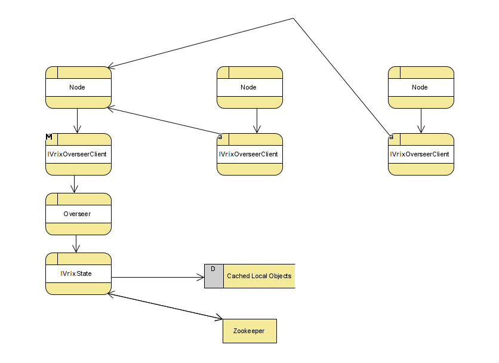
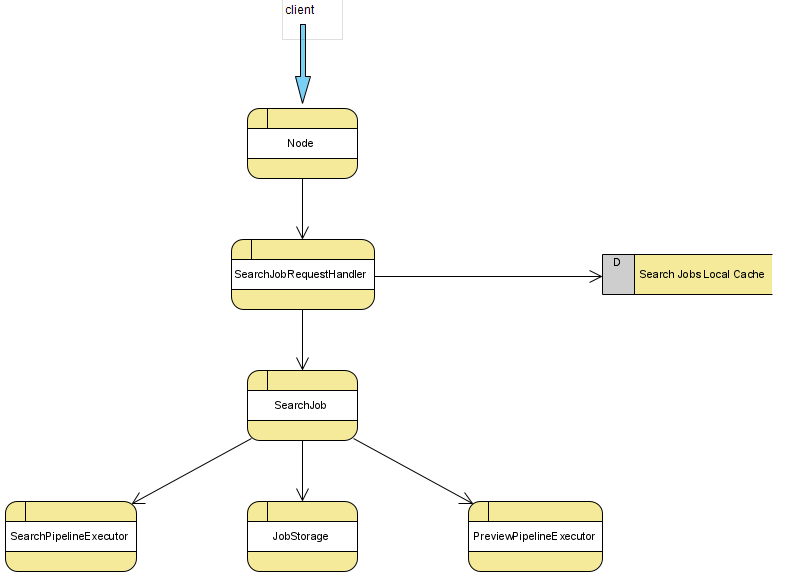
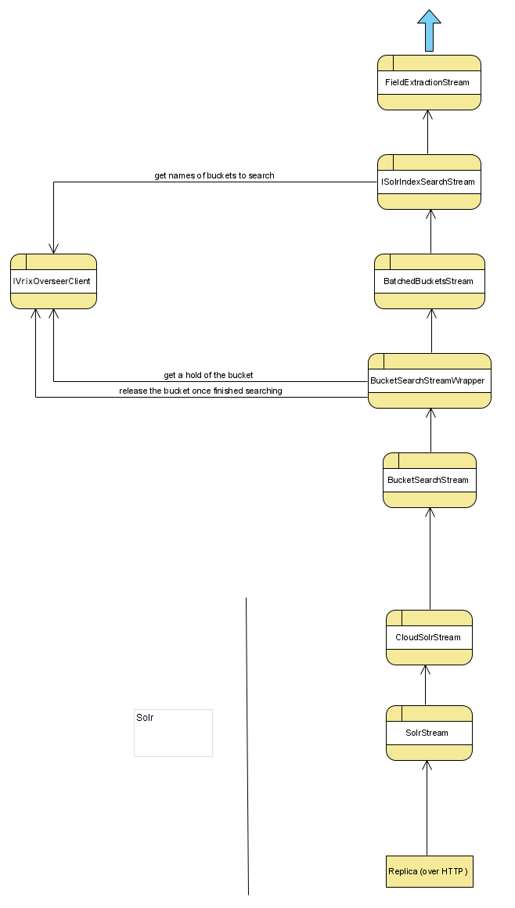

## Architecture Overview
__**_KEY THEMES AND GUIDELINES_**__:
* IVrixDB and Solr can co-exist on the same nodes
* Solr’s existing functionality should not be impacted
* Lean on Solr’s extensible plug-in architecture as much as possible
* No code changes to the solr code. Additions can be accepted (**though none was made**)
* Use Solr’s already-built code and behave as much as Solr as possible
* no degradation in performance or scalability compared to Solr
  + Clustering and high availability
  + Automatic node recovery
  + Automatic data rebalancing
  + Horizontal scalability and more

## IVrix Node
The "IVrix Node"s base is built upon the "controller" replica on each Solr Node (making a collection of these replicas, known as the controller collection). This replica is responsible for booting up the residing IVrix Node, receiving requests for indexing and searching, administrative operations for IVrixDB in general, and shutting down the residing IVrix Node.

## IVrix Overseer
The IVrix Overseer is responsible for managing the IVrixDB global state, the IVrix indexes and their respective buckets. It is a thread-safe, fault-tolerant, leader-elected (and re-elected) role that any IVrix Node can take on. The election works through Zookeeper and is a "first-come, first-serve" election. Each request to the Overseer is a new thread, and so the Overseer is designed to be a thread-safe object. Since most operations need to first communicate with it, the Overseer is designed to execute operations concurrently. The IVrix Overseer sends commands over to Solr’s Overseer to change Solr’s state, thereby allowing Solr to manage its own state undisturbed.

The Overseer also manages the overall bucket attachment count across all IVrix Indexes at each IVrix Node. It does so at each bucket creation by executing index rollover commands if necessary, and at each bucket hold request (for search) by executing attach/detach commands if necessary.

The Overseer implements fault-tolerance by enabling its operations to work around dead nodes and by ensuring consistency and recovery from non-completed operations at three major checkpoints: Overseer boot-up, Overseer handling of Node boot-up, and Overseer handling of Node shutdown. It ensures that it can stay consistent and recover at those checkpoints because each Solr-state-changing operation first marks the change in IVrixDB's state at Zookeeper before enacting the operation. The ONLY exception are deletion commands, which first delete from Solr state before deleting from IVrixDB state.

Since the Overseer is a leader-elected object and there are dormant Overseer's waiting to be elected as leader for every IVrix Node, requests are sent to the Overseer through the IVrix Overseer Client, which finds the elected leader and sends the request to it.

 

 

## Indexing
An IVrix index is a schema-less and distributed timeseries index with data aging capabilities. It is separated into buckets, where each bucket is a slice of the index. The schema of the Index is comprised of two fields: a raw log, and the extracted timestamp. Each bucket is the equivalent to a Solr shard, where its age rolls through the states of HOT, WARM, and COLD.
* HOT buckets are replicated across the cluster are being actively written into
* WARM buckets are replicated across the cluster that cannot be written into
* COLD buckets are local and cannot be written into. For this state, a new feature was created so that COLD buckets can be detached/re-attached into Solr for resource management purposes.

Currently, an IVrix Bucket is created as a Solr Collection with only one shard, a leader replica that resides in the node that the Bucket belongs to, and replication replicas across the cluster according to a provided replication factor. It is important to note that even though buckets can be spread across the cluster, they still belong to the node that initially had the leader replica on it. This allows each IVrix Node to manage its own IVrix Buckets.

As an IVrix index grows, and reaches certain criterias, it will perform bucket rollovers, where the oldest buckets in each age state that reached maximum capacity are rolled to the next state. This is done by the IVrix Overseer when it executes a CREATE BUCKET operation.

Indexing into a bucket uses Solr’s internal indexing procedures. Any node can index into an IVrix Index, and each node manages its own HOT buckets for each index. Each node creates its own HOT buckets and rolls them over to WARM once its finished with them. These operations occur through the IVrix Overseer. As an IVrix index grows, and reaches certain criterias, it will perform bucket rollovers, where the oldest buckets in each age state that reached maximum capacity are rolled to the next state. This is done by the IVrix Overseer when it executes a "create bucket" operation.

Index rollover holds higher priority than search. When all buckets in an age state are being "held" (more on this in the next section,) index rollover will forcibly move a bucket to the next age state to make space, regardless of whether it will disturb search.

To balance across nodes, IVrixDB provides a load balancing option ("event forwarder") that batchifies the event stream and sends them out in a round-robin fashion to nodes.

The combination of round-robin batchified indexing and independent bucket management per node creates the indefinite occurrence of overlap between the span of buckets. This prevents from absolute time-order searching to occur. To solve this, the IVrix search feature searches in a way that does not depend on the underlying sort order of the incoming stream of events (discussed in the next section.)

 

 

 

## Searching
Through the IVrix Index, IVrixDB enables full search and analytics on Fields that do not exist in the schema. IVrixDB builds its searching functionality on top of Solr’s Streaming API. The basis of IVrix’s Search-Time Field Extraction (STFE) is executed by applying user-defined regexes to the raw log on each tuple. This has very minimal impact on the CPU and very minimal impact on search times, due to the Streaming API’s main bottleneck being disk read speeds.

(**Currently, the regexes are hard coded as a whitespace delimiter. This was done to build the POC around the main idea. This will be replaced with configurable regexes in the future.**)

The way an IVrix Index is searched is by first searching HOT buckets, then WARM buckets, then COLD buckets. Within each age state, the buckets are searched from latest to oldest. The search method can also handle situations where the data will not be retrieved in time order, as the method by which the IVrix index is built (discussed in the previous section) will almost certainly result in overlap between buckets.

Since buckets have the potential to be detached before search and during search, buckets must be "held". A bucket hold means that the bucket is physically attached and cannot be detached until it is no longer being held by any search. Bucket holds are managed through the IVrix Overseer.

A Search in IVrix is referred to as a "Search Job". The idea of a Search job is to present the user with an interactive and incremental search experience. When a user creates a new Search Job with a streaming expression, and potentially a time range, it will immediately return a job ID. With that job ID, the user can poll the search components that enables the user to explore the data fluidly. Each component is incrementally updated at intervals and can be polled through the API. The components are:

* Dynamic Timeline
  + A timeline with a scope and timeline buckets (time bounds + count) of up to 300
  + Events (embedded component)
    - The resulting events
    - Can paginate through the events
    - Each timeline bucket can store up to 1k events
    - Can select a range, which would pick out the appropriate timeline buckets and can paginate through their collective events
* Results 
  + The resulting statistics (if requested)
* Field Summaries
  + A field summary per field, where the top values are shown, with their counts and percentages, and if the field is an integer, it would show min, max, and avg

To provide these features, a Search Job has two pipeline executors, and a storage object which holds the search components that the user can poll. The search pipeline is the pipeline where the stream expressions are executed. However, there are decorators where the pipeline would be "stuck". Some decorators in the pipeline are non-streaming decorators, like sort/top, where the entire dataset needs to be read before moving on to the next decorator in the pipeline. That prevents the search from being incremental and interactive. The preview pipeline fixes this issue by returning a snapshot of the results at an interval, beginning from where the search pipeline is "stuck".

To create these pipelines, the user-given streaming expression is copied and manipulated for each pipeline. In both, non-intrusive IVrix streaming decorators called PushTuplesToJobStream push Events and Results into the Search Job storage object. In the search pipeline, all non-streaming decorators (like sort/top) are replaced by IVrixDB’s own implementation of them called NonStreamProcessorStream. In the preview pipeline, all non-streaming decorators are replaced by a decorator called NonStreamPreviewStream. This object has two modes of behavior; one where it pauses the processing of a search pipeline’s NonStreamProcessorStream to read its generated tuples as a source, and another where it behaves like the expected NonStreamProcessorStream. The behavior is chosen at each preview pipeline execution based on where the search pipeline is "stuck". The tail end of the preview pipeline is removed, since it’s data source is a NonStreamProcessorStream, and not a Solr source decorator (like "search").

 

 
 
 

 

 
 
 
 
 
 
 

 

 

 

 
