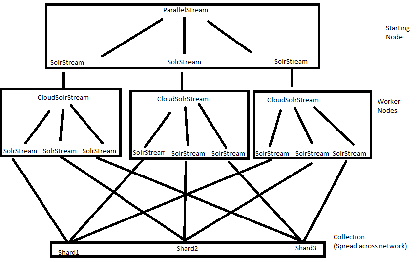

# Apache Lucene and Solr (In Relation to IVrixDB)
Apache Lucene is a high-performance, full featured text search engine library. Solr is an enterprise search platform written on top of Lucene. Major features include full-text search, index replication, sharding, and streaming. Below are descriptions of Solr architecture and internals of both Lucene and Solr that relate to the IVrixDB project.

## Lucene Index -- Storage and Usage
### Segmentation
Lucene's index is composed of segments, each being a completely searchable index on a subset of all documents. Each document has a document ID in the local context of a segment and global context of the index.
### Postings
Lucene's core, the inverted index, is comprised of "postings." The postings can be thought of as a map that provides efficient lookup given a Term to Documents containing that Term.
### Stored Fields
Stored Fields provide efficient retrieval of field values given a document ID. All stored fields for a given document are compressed and stored in a block on disk and retrieved together. Stored Fields are not efficient for sorting, since they require the usage of the FieldCache, which un-inverts the index during runtime. Bulk-reads are constant.
### DocValues
DocValues is a document-list-to-value mapping built at index time and stored in disk or on RAM, or both.The mapping is ordered for sequential reading, which is very efficient for queries with sorting. DocValues compression involves compressing the values and collapsing value redundancy. DocValues does not require the entire document to be uncompressed to be used. Because of these factors, DocValues can provide faster bulk-reading speeds if the data has high cardinality or if only a small-subset of the document needs to be presented. However, DocValues are less efficient than stored fields when it comes to randomly accessing documents.

## SolrCloud Architecture
* ZooKeeper – Stores the global state of a Solr Cluster. manages the configuration context of a Cluster, so that Nodes can refer to other Nodes and that changes can be made easily.
* Cluster – A conglomerate of Nodes
* Node – A Solr server with multiple Cores
* Collection – A collection is a namespace that has a common schema and indexed data
* Shard – A shard is a partition of a Collection. Shards enables a Collection to be spread across the Cluster, enabling parallel computing.
* Replica – Replicas copy a Shard for redundancy. In a Shard, one replica is the leader, and it is responsible for the indexing process. All other replicas backup according to the leader.  It is an individual Solr instance (index).
* **Overseer Role** – The Overseer is the main manager of the Solr Cluster, and it heavily interacts with the Zookeeper. It is a leader elected role, and any Node can become the Overseer. Below is an illustration of the inner workings of the Overseer (please excuse the awful handwriting…I did not have time to write it digitally):

## Solr Indexing
Solr Indexing works by update commands. An update command can be "add", "delete", "commit", "merge", and "rollback". The indexing pipeline is called an UpdateProcessorChain, an each UpdateProcessor modifies the update command until DistributedZkUpdateProcessor, which disperses and routes documents to each shard leader.

Once a document has reached the shard leader replica, it will index into that replica, and the other replicas will replicate from the shard leader.

## Solr Streaming
Solr has a Streaming API that enables users to query a collection and receive a stream of the results. The Streaming API is built on a querying language called Streaming Expressions. These expressions wrap on one another (like the Decorator Pattern) to provide a pipeline of operations that will execute to return the results.
### Search Handlers
Solr provides two handlers -- export and select. Each query a single core and stream the results to the Stream Source pipeline.

The Select handler is not true streaming. It queries the index, loads the documents to memory, and then streams them to the pipeline. On the other hand, the Export handler is real streaming. It queries the index in batches of 30,000, loads those documents into memory, streams them to the pipeline, and starts over.

Because of this, the Select handler is used for prototyping streaming expressions and the Export handler is used for production. Additionally, to prevent the user from causing bottlenecks, the Select handler requires the user to specify the number of documents to select.

The Export handler is hard-coded to require DocValues for all exported fields. This improves reading speeds when not all the document fields are requested.

### Streaming Pipeline
#### Overview
* Stream Decorators -- Run on top of each other and request SearchFacadeStream to retrieve documents
* SearchFacadeStream -- decides whether to use the export or select handlers

Export Handler pipeline
* CloudSolrStream -- Node takes a stream expression and distributes it across Cores and pools their results while sorting them using TreeSet.
* SolrStream -- Core takes a stream expression and begins the stream with a search handler.
* Export Handler -- queries the index in the way described above

Select Handler pipeline
* SearchStream -- Node takes a stream expression and distributes it across Cores, and pools while sorting their results
* Select Handler -- queries the index in the way described above

Pipeline-Changing Decorators
* ParallelStream -- Takes a stream expression (a search in our case) and distributes it across N Nodes, and pools while sorting their results.

#### CloudSolrStream Details
CloudSolrStream pools results using TreeSet. TreeSet is a self-balancing binary search tree that keeps its data sorted. Each object in the TreeSet is a TuppleWrapper that is the recent item of a SolrStream and can read the next. Conceptually, each object in the pool is a SolrStream sorted based on the most recent item.

Initially, each stream is read to fill up the pool, and TreeSet sorts the objects automatically. Then, for every read, CloudSolrStream pops the smallest item in the TreeSet, calls read next on that item. That result is then placed intro TreeSet, which sorts (balances the tree) automatically.

This means CloudSolrStream is calling read only on one stream at a time, and that stream has the highest probability of providing the next smallest item.

#### ParallelStream Details
ParallelStream replicates the same streaming expression to N nodes, shuffles search results between them, and sorts the streams returned by the worker nodes. ParallelStream extends CloudSolrStream to utilize the TreeSet pooling method explained above.

ParallelStream creates N SolrStreams, with each one holding parameters (expression, numWorkers, workerID, partitionKeys). Each SolrStream sends its query/parameters to a node, where a new CloudSolrStream object is made. Each of those CloudSolrStream queries all the shards in the collection. In addition, they also send a hash filter query with the regular query.

The Export Handler in each shard uses HashQParserPlugin to parse the hash filter query and restrict its output to only a certain subset of the shard. This way, all the data in the shard is partitioned across worker nodes. The flow described above is illustrated in this diagram:

